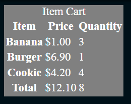
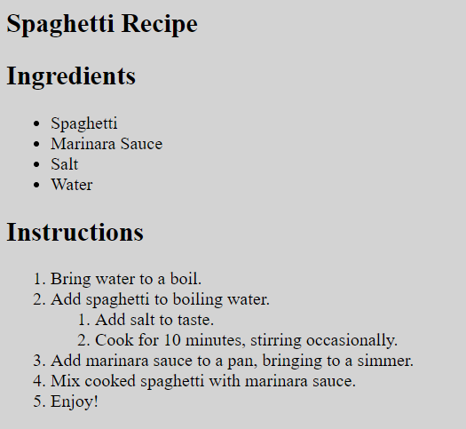

# #1 HTML 1 - Formulario de Registro
Implementa un formulario de registro en HTML con los siguientes seis campos de entrada, cada uno con una etiqueta apropiada:

Nombre de usuario, un campo de texto requerido.
Contraseña, un campo de contraseña requerido.
Correo electrónico, un campo de correo electrónico requerido.
Número de teléfono, un campo de teléfono opcional.
Fecha de nacimiento, un campo de selección de fecha opcional.
Acepto los Términos y Condiciones, un campo de checkbox requerido.
También debe haber un botón de 'Registrarse' al final del formulario. Cuando se haga clic en el botón (y si se han completado todos los campos requeridos), el botón debe enviar el formulario utilizando el comportamiento predeterminado del navegador.

Ten en cuenta que enviar el formulario en la vista de tu navegador o en la vista de resultados esperados mostrará una página rota; este es un comportamiento normal, ya que estas vistas se representan en iframes.

Solo necesitas escribir el HTML que iría dentro de la etiqueta <body> del documento; no es necesario preocuparse por la etiqueta <head>, la etiqueta <html> ni la declaración <!DOCTYPE>."

# #2 HTML 2 - Implementa un carrito de compras en HTML con los siguientes datos estáticos:

|   Producto   |   Precio   |   Cantidad |
|-------------+-----------+--------------|
|   Plátano   | $1.00     | 3            |
|  Hamburguesa | $6.90     | 1           |
|    Galleta  | $4.20     | 4            |
|-------------+-----------+--------------|
|    Total    | $12.10    | 8            |

El código HTML debe usar una tabla con el marcado semántico adecuado y con el título "Carrito de Compras".

Solo necesitas escribir el HTML que iría dentro de la etiqueta <body> del documento; no es necesario preocuparse por la etiqueta <head>, la etiqueta <html> ni la declaración <!DOCTYPE>.



# #3 HTML 3 -  Se te ha proporcionado una receta de espaguetis en texto plano, y necesitas convertir esta receta en un archivo HTML correctamente marcado.

La receta debe tener un encabezado principal que diga "Receta de Espaguetis", y debe dividirse en dos secciones, los ingredientes y las instrucciones, con los encabezados "Ingredientes" e "Instrucciones", respectivamente.

Los ingredientes son una lista desordenada con el siguiente contenido:

• Espaguetis
• Salsa marinara
• Sal
• Agua

Las instrucciones son una lista ordenada con el siguiente contenido:

1. Llevar el agua a ebullición.
2. Agregar los espaguetis al agua hirviendo.
   1. Agregar sal al gusto.
   2. Cocinar durante 10 minutos, revolviendo ocasionalmente.
3. Agregar la salsa marinara a una sartén, llevar a fuego lento.
4. Mezclar los espaguetis cocidos con la salsa marinara.
5. ¡Disfruta!

Ten en cuenta que "Agregar sal al gusto." y "Cocinar durante 10 minutos, revolviendo ocasionalmente." están en una lista secundaria bajo la segunda instrucción.

Tu código HTML debe usar un marcado semántico adecuado. Sin embargo, solo necesitas escribir el HTML que iría dentro de la etiqueta <body> del documento; no es necesario preocuparse por la etiqueta <head>, la etiqueta <html> ni la declaración <!DOCTYPE>.



# #4 CSS 1 - Se te proporciona un archivo HTML que contiene el marcado para el logotipo de Codr. Utilizando solo CSS, replica el resultado esperado siguiendo estas especificaciones:

El contenedor general tiene un color de fondo de #02203c.
El div #logo consta de 3 partes:
En el centro se encuentra el círculo interior. Este es un círculo con un ancho y alto de 10px y un borde blanco sólido de 5px. El borde izquierdo del círculo interior está a 50px del borde izquierdo del #wrapper.
El primer anillo tiene un ancho de 100px, una altura de 30px y un radio de borde de 50%. También tiene un borde blanco sólido de 5px. Este anillo está girado de manera que el borde izquierdo esté en la parte superior izquierda y el borde derecho esté en la parte inferior derecha.
El segundo anillo es igual que el primer anillo, pero está girado en la dirección opuesta (es decir, el borde izquierdo está en la parte inferior izquierda y el borde derecho está en la parte superior derecha).
A la derecha del logotipo se encuentra el texto "Codr". Este texto es de color blanco, con un tamaño de fuente de 48px y la fuente de familia monoespaciada predeterminada del sistema. Este texto está a 50px del borde derecho del círculo interior del logotipo.
Tanto el logotipo como el texto están centrados verticalmente en el contenedor #wrapper.

Tu entrega será evaluada en función de cuán similar sea tu resultado en el navegador al resultado esperado; debe ser casi idéntico.

``` Como debería quedar ```


``` Como queda tras resuelto (considerando que es un recorte con zoom)``` 

